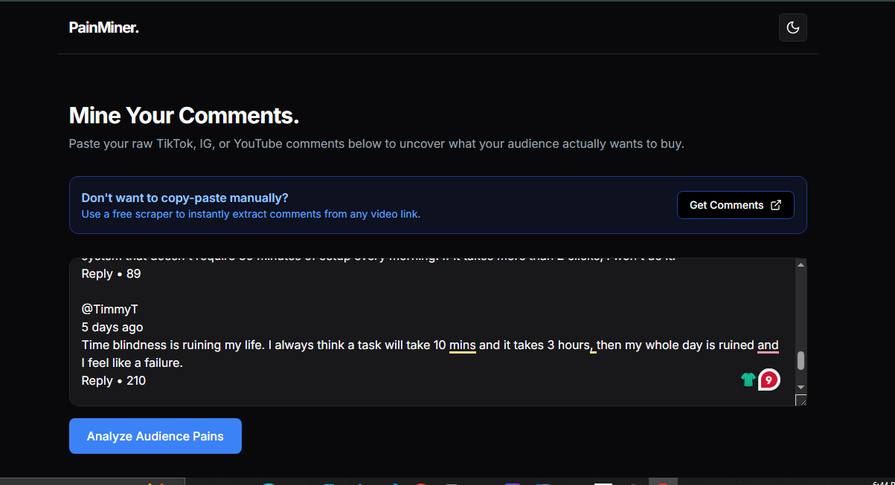
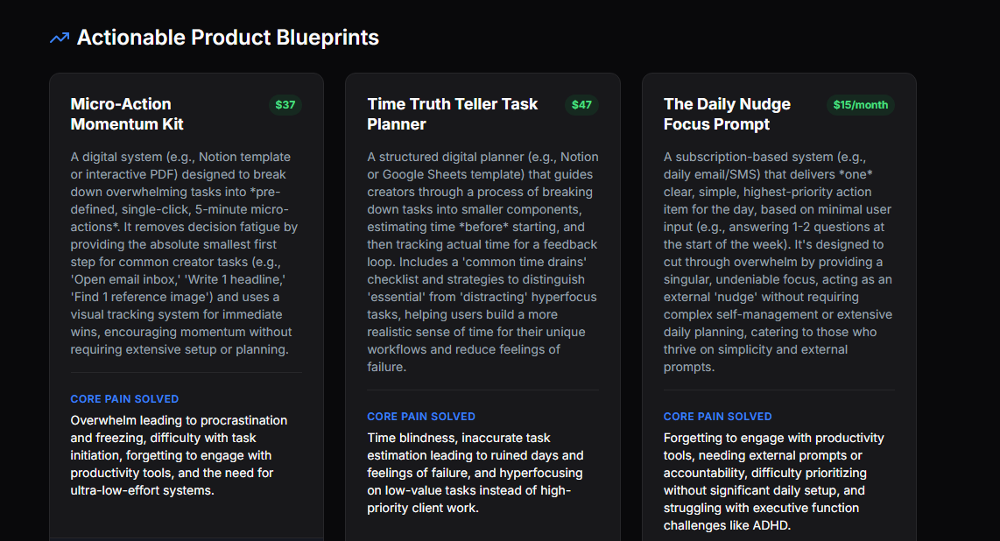
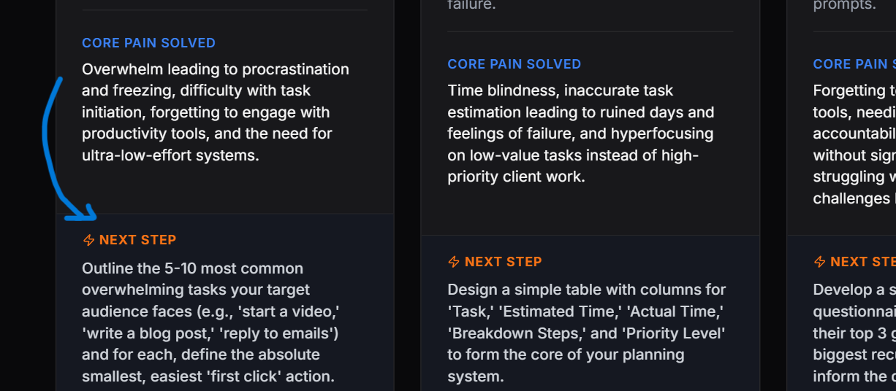

# THIS IS THE MVP THAT VALIDATES CREATOR PRODUCTS USING RAW COMMENTS SO YOU STOP BUILDING TO CRICKETS.

i'm building something that actually sells :)

this is a next.js web application that helps turn messy youtube, tiktok, or instagram comments into highly validated, ready-to-sell digital product ideas.

the goal is simple:
stop guessing what your audience wants.
find out exactly what they are begging for.
make it fast and easy to build.

### why i made this

creators on platforms like stan.store have a massive "proof problem."

they spend weeks building a $40 notion template or a 5-day video course. they launch it to their audience. and then... zero sales. crickets.

why? because they built what *they* wanted to teach, not the specific pain point their audience actually wanted to pay to solve.

the biggest goldmine for product ideas is the comment section. but reading and categorizing 500 comments by hand is a nightmare. that was the unlock for me. so i built this tool to let ai do the heavy lifting, analyze the friction, and spit out exactly what the creator should build today.



### what it does

* takes raw comment dumps from your audience
* runs them through a custom ai analyzer (gemini 2.5 flash)
* ignores the spam, emojis, and noise
* generates 3 validated digital product ideas side-by-side
* gives a suggested price point based on the value
* gives the literal first action step to start building it immediately

### features

**the UI**

* premium dark mode / light mode toggle
* built with shadcn and tailwind css for a sleek feel
* built-in guide linking to free comment scrapers so you don't have to copy-paste manually

**the engine (BYOK)**

* "bring your own key" architecture
* runs entirely on your own free google gemini api key
* no hidden server costs, no rate limits from a central server

**the output**

* custom prompt engineering forces the ai into a strict product-strategist persona
* outputs clean, actionable cards: title, description, core pain solved, price tag, and next step



### tradeoffs

* **manual data entry:** this is v0.1. it does not automatically connect to the instagram or youtube api yet. you have to use a free scraper (like exportcomments) and paste the text in.
* **garbage in, garbage out:** if you paste in comments from a video that only says "fire emoji" or "first," the ai can't invent a pain point. it needs actual engagement to work.
* **no database:** there is no local storage or cloud database in this version. once you refresh the page, your generated ideas are gone. screenshot them or build them!



### setup (local / dev)

you only need a terminal and a free api key from google ai studio.

**1) clone and install**

```bash
git clone https://github.com/zumermalik/painminer-v0.1.git
cd painminer-v0.1
npm install

```

**2) start the dev server**

```bash
npm run dev

```

**3) use it**

* open `http://localhost:3000`
* get your gemini api key from google
* paste the key into the UI
* grab some comments, paste them in, and hit analyze

*note: if you are deploying this to vercel, you don't need to configure any `.env` files. the architecture allows the user to input their key directly on the live site.*

### how to use it well

* **start with a scraper:** use the link in the ui to scrape a video that has a lot of "how do you..." or "i struggle with..." comments.
* **don't overthink the formatting:** you can paste a completely raw, messy dump of text. the ai is designed to clean it up.
* **take the first step:** the tool gives you a "Next Step" for a reason. if it says "outline 3 chapters," open a doc and do it right then.
